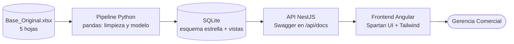
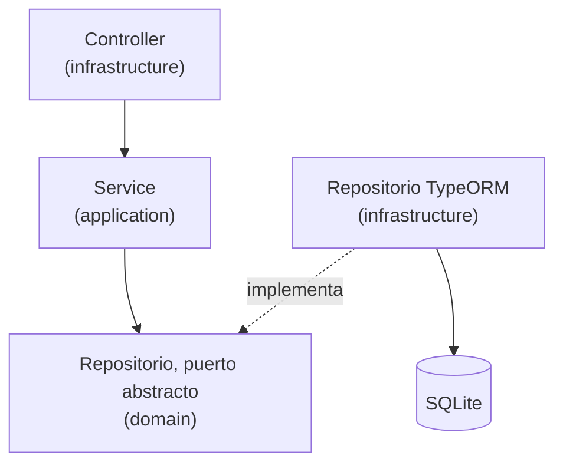
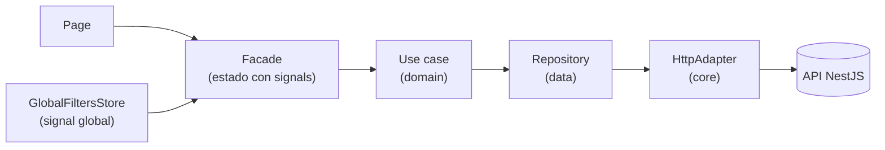

# AFS Dashboard

.png>)

Aplicación web para que la Gerencia Comercial de **Atlantic Food Service** siga las ventas de enero a junio de 2026 sin depender de archivos de Excel. Es una solución de tres capas: un pipeline que limpia y modela el Excel fuente, una API REST propia y una aplicación web interactiva.

**Vistas principales**

- **Resumen:** KPIs con variación contra el mes anterior, tendencia mensual y venta por sede.
- **Asesores:** ranking por sede; al abrir un asesor se ven su evolución mensual y sus principales clientes.
- **Clientes:** tabla paginada con búsqueda y orden por columna; ficha del cliente con su historial de compras.
- **Filtros globales** de fechas, sede y asesor que afectan todas las vistas.

## Enlaces

| Recurso                  | URL                                                    |
| ------------------------ | ------------------------------------------------------ |
| Aplicación publicada     | https://afs-dashboard-nine.vercel.app/                 |
| Documentación de la API  | https://afs-api.onrender.com/api/docs                  |
| Hallazgos de calidad     | [DATA_QUALITY.md](./DATA_QUALITY.md)                   |
| Resumen para la gerencia | [docs/resumen_gerencia.md](./docs/resumen_gerencia.md) |

## Arquitectura



Tanto el backend como el frontend están organizados **por features** (`advisors`, `clients`, `sales`/`summary`), y dentro de cada feature por capas (presentation, domain, data) o en backend (infrastructure, application y domain). Cada feature se puede leer, probar y modificar sin tocar las demás y siguiendo una dirección.

Tambien están abstraidos los datos en la carpeta core (httpClient, configs, database, etc) para su facil implementació y reutilización.

### Datos

El pipeline lee `Base_Original.xlsx`, limpia las cinco hojas y genera `db/afs_commercial.sqlite` con un esquema estrella:

- **Hechos:** `fact_ventas`.
- **Dimensiones:** `dim_clientes`, `dim_materiales`, `dim_asesores` (asesor y sede) y `dim_tiempo`, más las relaciónes `rel_cliente_asesor`.
- **Vistas de apoyo:** `view_ventas_agregadas` (venta mensual por sede y asesor) y `view_clientes_resumen` (información resumida de los clientes).

Las vistas agregadas evitan recorrer las ~446.700 filas de ventas en cada consulta de resumen. Cada hallazgo de calidad (qué se encontró, cuántos registros afecta y cómo se resolvió) está en [DATA_QUALITY.md](./DATA_QUALITY.md).

### Backend (NestJS)

Cada feature sigue tres capas con dependencias hacia adentro:



- **domain:** DTOs, tipos, entidades y los puertos (clases abstractas de repositorio).
- **application:** servicios con la lógica de negocio (por ejemplo, la variación contra el mes anterior).
- **infrastructure:** controllers REST y repositorios TypeORM que implementan los puertos.
- **core / shared:** base de datos, ajuste de documentación Swagger, filtros de excepciones, DTOs comunes (`SalesFilterDto`) y utilidades de periodos.

```
backend/src
├── core/        database · ajuste de docs · filters
├── features/    advisors · clients · sales · health
└── shared/      application/dtos · utils
```

### Frontend (Angular)

Cada feature tiene tres capas (`presentation`, `domain`, `data`) y el flujo va en una sola dirección:



- Las **pages** solo consumen el estado del facade; los **facades** coordinan los use cases y exponen signals.
- El **`GlobalFiltersStore`** guarda los filtros globales en un signal. Cada facade lo lee dentro de su flujo reactivo, así que al aplicar un filtro la vista abierta se vuelve a consultar sola, y las peticiones obsoletas se cancelan.
- El estado de la tabla de clientes (página, búsqueda y orden) vive en la **URL**: al abrir alguna ficha de algun cliente y volver atrás, la tabla queda como estaba.

```
frontend/src/app
├── core/        http · navigation · routes · theme
├── features/    summary · advisors · clients · health
├── layouts/     main-layout · global-filter-fab
└── shared/      components · global-filters · utils
```

## Stack y por qué se eligió

El criterio principal fue **reducir el riesgo**: con dos días para una solución lo más completa posible, prioricé tecnologías que ya conozco bien para dedicar el tiempo a los datos, las cifras y los detalles de experiencia, y no a aprender herramientas nuevas en el camino.

| Capa          | Tecnología                               | Por qué                                                                                                                         |
| ------------- | ---------------------------------------- | ------------------------------------------------------------------------------------------------------------------------------- |
| Datos         | Python, pandas                           | Estándar para limpiar datos tabulares; 446.700 filas caben cómodamente en memoria.                                              |
| Base de datos | SQLite                                   | Sin servidor que operar, el archivo viaja con el repositorio y la carga de trabajo es de solo lectura. Reproducible en minutos. |
| Backend       | NestJS, TypeORM                          | Estructura modular que encaja con la arquitectura por features; validación de DTOs y Swagger integrados.                        |
| Frontend      | Angular                                  | Signals y tipado estricto; estructura clara para un proyecto con varias vistas y estado compartido.                             |
| UI            | Spartan UI, Tailwind CSS                 | Componentes accesibles y personalizables, y utilidades CSS para un diseño responsive rápido.                                    |
| Gráficos      | TanStack Charts                          | Tooltips y formato de ejes configurables, integrado con el tema de Spartan.                                                     |
| Tablas        | TanStack Table                           | Paginación, orden y búsqueda del lado del servidor sin reinventar la tabla.                                                     |
| Calidad       | Vitest, oxlint, Prettier, GitHub Actions | Pruebas rápidas, lint veloz y formato uniforme verificado en cada PR.                                                           |
| Despliegue    | Vercel (frontend), Render (API)          | Capas gratuitas y despliegue directo desde GitHub.                                                                              |

## Estructura del repositorio

```
.
├── data/                # Excel fuente (Base_Original.xlsx)
├── pipeline/            # ingesta, limpieza, modelo y pruebas de calidad (Python)
├── db/                  # base SQLite generada
├── backend/             # API NestJS y pruebas
├── frontend/            # aplicación Angular
├── docs/                # resumen para la gerencia
├── .github/workflows/   # integración continua
├── docker-compose.yml
├── .env.example
├── DATA_QUALITY.md
└── README.md
```

## Cómo correr el proyecto localmente

Requisitos: Node.js 24 y Python 3.11 o superior.

**1. Entorno de Python y dependencias**

```bash
python -m venv .venv
```

Activa el entorno:

```bash
# Windows (PowerShell)
.\.venv\Scripts\Activate.ps1

# macOS / Linux
source .venv/bin/activate
```

Instala las dependencias:

```bash
pip install -r pipeline/requirement.txt
```

**2. Generar la base de datos**

Coloca `Base_Original.xlsx` en `data/` y ejecuta el pipeline:

```bash
python pipeline/data_ingestion.py
```

Pruebas de calidad de datos (conteo de filas, unicidad de llaves y total de ventas):

```bash
pytest pipeline/test_pipeline.py
```

**3. Dependencias de Node**

```bash
npm install
npm --prefix backend install # (Omitir si se va a ejecutar por docker)
npm --prefix frontend install
```

La instalación de la raíz configura Husky, commitlint y Prettier.

**4. Variables de entorno**

```bash
cp .env.example .env
```

**5. Levantar backend y frontend** (en dos terminales)

### Backend

#### Opcion A

Se puede levantar el backend por medio de docker, requiere Docker y que exista `db/afs_commercial.sqlite` (si no está en tu copia, genérala con los pasos 1 y 2).

```bash
docker compose up --build
```

#### Opcion B

Requiere haber instalado Node.js 24 y las dependencias del backend con `npm --prefix backend install`

```bash
npm --prefix backend run start:dev
```

- API: http://localhost:3000/api
- Swagger: http://localhost:3000/api/docs

### Frontend

Requiere haber instalado Node.js 24 y las dependencias del backend con `npm --prefix frontend install`

```bash
npm --prefix frontend start
```

- Aplicación: http://localhost:4200

## Variables de entorno

No hay credenciales ni secretos. Las variables están en `.env.example`:

| Variable       | Valor de ejemplo        | Descripción                                          |
| -------------- | ----------------------- | ---------------------------------------------------- |
| `PORT`         | `3000`                  | Puerto en el que escucha la API.                     |
| `NODE_ENV`     | `development`           | Entorno de ejecución (`development` o `production`). |
| `FRONTEND_URL` | `http://localhost:4200` | Origen del frontend permitido por CORS.              |

La URL de la API que consume el frontend se define en `frontend/src/environments/`.

## API

La documentación interactiva está en Swagger: https://afs-api.onrender.com/api/docs (en local, `http://localhost:3000/api/docs`).

Los endpoints de cifras aceptan los mismos filtros opcionales:

| Parámetro   | Ejemplo      | Descripción                                |
| ----------- | ------------ | ------------------------------------------ |
| `startDate` | `2026-01-01` | Inicio del rango. Los datos son mensuales. |
| `endDate`   | `2026-06-01` | Fin del rango.                             |
| `location`  | `BOGOTA`     | Sede.                                      |
| `advisor`   | `ASE-004`    | Código del asesor.                         |

Los parámetros se validan con DTOs y los errores se devuelven con códigos HTTP claros (400, 404, 500).

## Calidad de código y automatización

**Pruebas**

| Capa    | Comando                             |
| ------- | ----------------------------------- |
| Datos   | `pytest pipeline/test_pipeline.py`  |
| Backend | `npm --prefix backend run test:e2e` |

**Estilo y convenciones**

- **Prettier** para formato uniforme: `npm run format` (aplica) y `npm run format:check` (verifica).
- **Lint** en backend (oxlint) y en frontend: `npm run lint`, estas están en su respectiva carpeta para que se pueda ejecutar en su CI correspondiente.
- **Conventional Commits** verificados con **commitlint** y **Husky** antes de cada commit (`feat(api): ...`, `fix(pipeline): ...`, `docs: ...`).
- Flujo de trabajo: ramas por funcionalidad y Pull Request hacia `main`.

**Integración continua (GitHub Actions)**

| Workflow    | Se ejecuta cuando                                | Qué hace                                                                            |
| ----------- | ------------------------------------------------ | ----------------------------------------------------------------------------------- |
| Backend CI  | Cambian `backend/`, `pipeline/`, `db/` o `data/` | Genera la base SQLite con el pipeline, luego lint, pruebas e2e y build del backend. |
| Frontend CI | Cambia `frontend/`                               | Instala, lint, pruebas y build del frontend.                                        |
| Format      | Cualquier push a `main` o Pull Request           | Verifica el formato con Prettier en todo el repositorio.                            |

**Despliegue:** el frontend se publica en Vercel y la API en Render, ambos desde `main`.

## Decisiones y limitaciones conocidas

**Decisiones**

- **Vista agregada para los resúmenes.** Los endpoints de KPIs, ranking y tendencia leen la vista mensual por sede y asesor; el detalle de clientes e historial consulta los hechos.
- **Variación contra el mes anterior.** Se compara el **último mes del rango** contra el mes previo. Si no hay rango, se usa el último mes con datos. Cuando no existe un mes previo con ventas, la API devuelve `null` y la interfaz muestra un guion, no un `0%` engañoso.
- **Datos mensuales.** Todos los periodos caen en el día 1; el formulario de filtros normaliza cualquier fecha al inicio de su mes.
- **Estado en la URL para la tabla de clientes, en memoria para los filtros globales.** La ficha del cliente es una página aparte, y al volver atrás la tabla conserva página, búsqueda y orden.
- **Detalle de asesor.** Solo aplica el rango de fechas de los filtros globales; la sede y el asesor ya los define la ruta.

**Limitaciones**

- **Clientes activos en el ranking de asesores** es el promedio mensual de clientes activos del rango: la vista agregada guarda el conteo por mes y no los clientes individuales, así que no se puede calcular el número de clientes distintos sin repetir a quienes compran varios meses.
- **Primera respuesta lenta en la demo.** El plan gratuito de Render suspende la API tras un tiempo sin uso, y la primera petición puede tardar mientras despierta.
- **Base de datos de solo lectura embebida.** Para actualizar los datos hay que volver a ejecutar el pipeline y reconstruir la imagen o reiniciar el despliegue.
- **Sin autenticación.** La aplicación es de consulta y no maneja usuarios.
